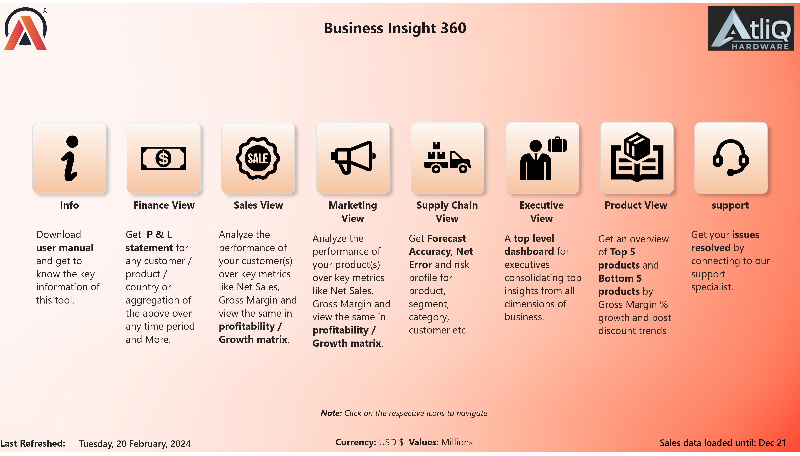
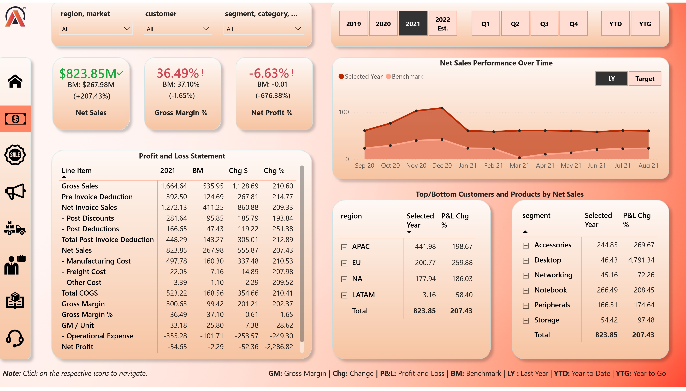
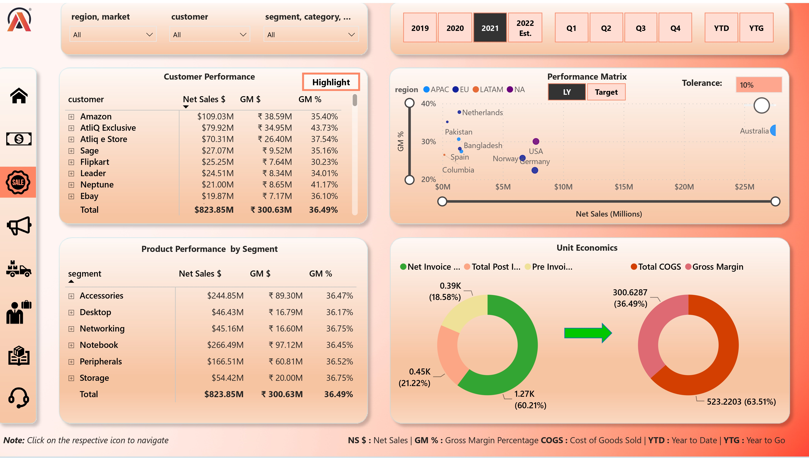
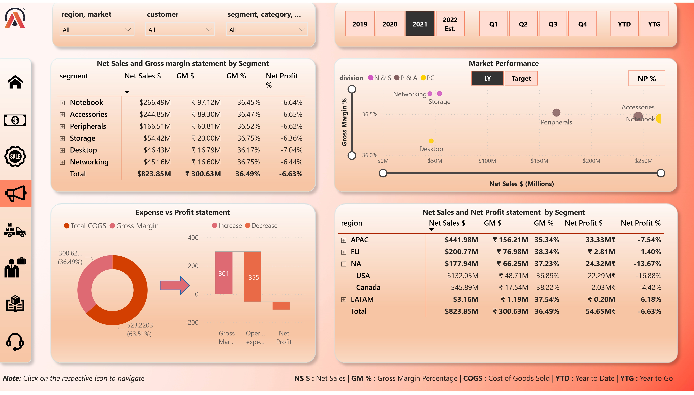
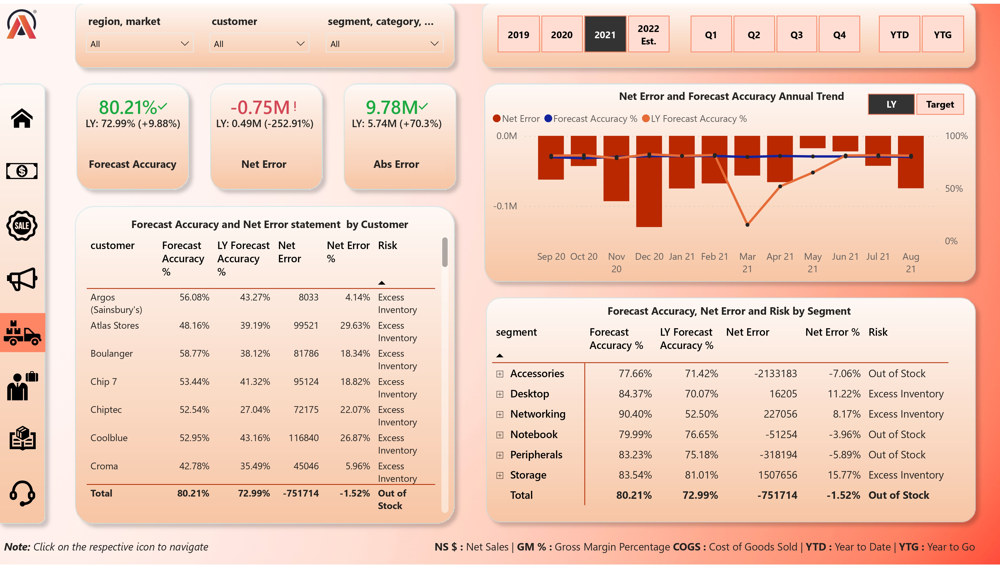
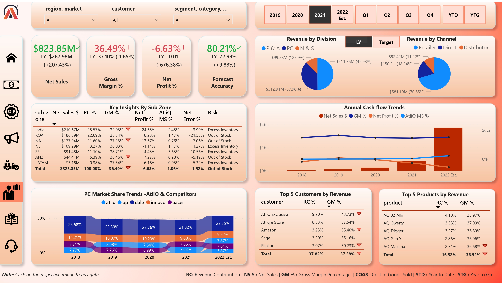
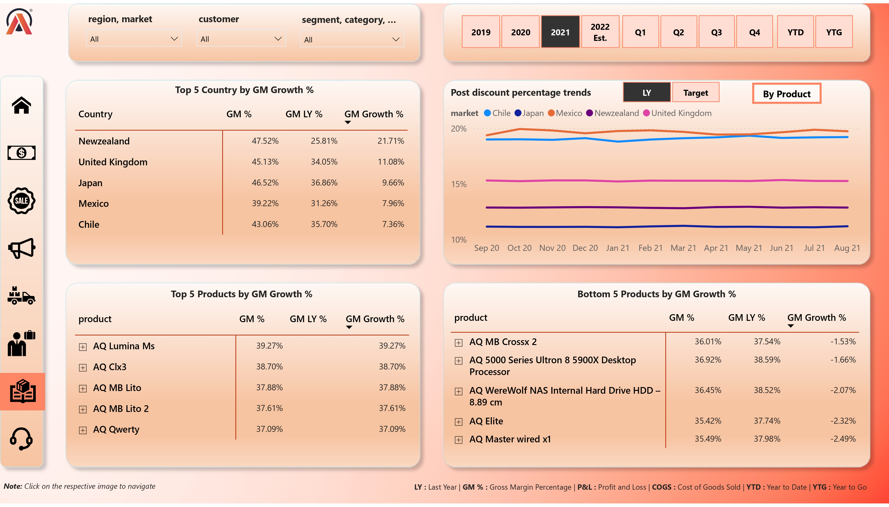

# AtliQ Hardware BI 360 Dashboard

## Project Overview

Welcome to the AtliQ Hardware BI 360 Dashboard project! 

### Introduction
AtliQ Hardware is an ambitious company striving for excellence in the hardware industry. This project marks the initiation of our journey into implementing advanced data analytics using Power BI. Our objective is to harness the power of data to drive informed decision-making across key business functions, including finance, sales, marketing, and supply chain management.

### Objective
The primary goal of this project is to establish a robust data analytics framework using Power BI. By doing so, we aim to empower stakeholders with comprehensive insights, enabling them to make strategic decisions that positively impact our business outcomes.

### Tools Utilized
To achieve our objectives, we have employed a range of tools and technologies:

- **SQL**: Utilized for efficient data retrieval and manipulation from various databases.
- **Power BI Desktop**: Employs interactive visualizations and dashboards to present actionable insights.
- **Excel**: Used for data preprocessing and initial analysis tasks.
- **DAX**: Enables advanced calculations and data modeling within Power BI.
- **DAX Studio**: Facilitates the optimization of Power BI report performance.

### Project Methodology
We adopted an Agile methodology for this project, allowing us to iteratively develop and refine the Power BI dashboards based on stakeholder feedback.

**Example:**
Questions > Mockup/sketch/plan > Prototype > Publish > Feedback > Questions 

### Data Sources and Data Pipeline

### Resources
- [Codebasics Power BI Course](https://codebasics.io/courses/power-bi-data-analysis-with-end-to-end-project) - Providing foundational knowledge for the project.
- [Live Report Link](https://app.powerbi.com/view?r=eyJrIjoiZDk3YTlhNWItYTY0MC00NWI0LWFhODktZDA4NzhhYzE0MmE2IiwidCI6ImM2ZTU0OWIzLTVmNDUtNDAzMi1hYWU5LWQ0MjQ0ZGM1YjJjNCJ9&pageName=ReportSection03c354455aa706134252) - Access the live Power BI report.
- [Presentation]: (To be added) - This will provide a comprehensive overview of the project and its outcomes.
- [Article]: (To be added) - A detailed article discussing the methodologies and findings of the project.

### Dashboards:

Our project caters to various stakeholder needs and preferences, offering insightful dashboards across key business areas: 

### Home or Landing page view:

### Finance View:

 
### Sales View:

 
### Marketing View:

 
### Supply Chain View:

### Executive View:

### Product View:

These dashboards encapsulate crucial metrics and KPIs tailored to each business function, providing a holistic view of our operations and performance.

Explore the full Dashboard here:  [Live Report Link](https://app.powerbi.com/view?r=eyJrIjoiZDk3YTlhNWItYTY0MC00NWI0LWFhODktZDA4NzhhYzE0MmE2IiwidCI6ImM2ZTU0OWIzLTVmNDUtNDAzMi1hYWU5LWQ0MjQ0ZGM1YjJjNCJ9&pageName=ReportSection03c354455aa706134252)

Thank you for exploring the AtliQ Hardware BI 360 Dashboard project! We are excited about the possibilities this initiative brings to our organization and look forward to leveraging data-driven insights for future success.